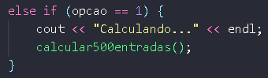
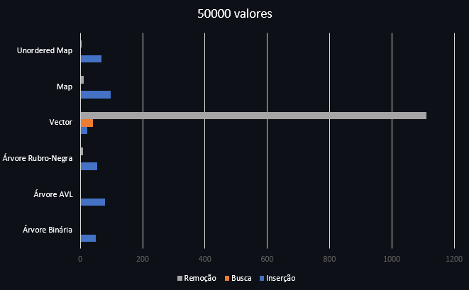

# Comparação das Estruturas em Árvore

<h2>Problema</h2>

Até o momento trabalhamos com três modelos de árvore, binária, avl e redblack. Chegou o momento de compararmos tais estruturas, observando seu comportamento sob diferentes volumes de dados. Para tanto, elabore arquivos que contenham 500 , 5000 , 50.000 , 500.000 entradas numéricas do tipo ponto flutuante. Para tanto, tente evitar repetições de valores em grande escala para que possamos ter uma estrutura profunda. Considere produzir os menores a partir dos maiores volumes de forma randômica. Feito a isso, vamos testar os seguintes processos:

1) Qual o tempo gasto com pesquisa para um arquivo de entrada com 10.000 consultas. Considere como consulta a busca de um determinado número na estrutura escolhida. Para cada pesquisa, é preciso remover o elemento da árvore, retornando esse número para o usuário. Então, considere o processo de remoção como parte final do processo. 

2) Qual o tempo necessário para montar a estrutura em memória. 

3) Qual o ganho dessas estruturas ao compará-las a vetores ordenados e aplicados à pesquisa binária. Qual o tempo gasto com a ordenação do vetor? Foi possível produzi-lo em memória? 

4) Adotando como estrutura o map e unorder_map do C++, há ganhos maiores nesse processo de pesquisa?

Elabore um relatório detalhando a implementação dessas estruturas, funcionamento da aplicação, exemplo de resultado, modo de compilação e conclusões. Considere essa última seção como uma discussão de quando adotar cada estrutura acima citada e o por quê de tal escolha. Para toda essa discussão, apresentar gráficos que demonstrem os resultados obtidos durante o processo de análise.

  

<h2>Estruturas Utilizadas</h2>

* <h3>Árvore Binária</h3>

	Em uma árvore binária, cada elemento é denominado nó da árvore e sua posição na estrutura pode levar a uma de três nomenclaturas. Se o nó é o primeiro inserido, denominamos tal elemento como <b>raiz</b> da árvore. Partindo da <b>raiz</b>, temos por designação dois filhos, <b>filho esquerdo</b> e <b>filho direto</b>. Um filho é posicionado a esquerda, se somente se, seu valor de teste é menor que o valor do nó onde este será conectado. Este nó de conexão é conhecido como <b>nó pai</b>. Por conseguinte, os filhos tidos como direitos seguem a mesma regra, contudo, para valores maiores.

 

 Fig 1. Exemplo de estrutura

Para mais informações acesse:  <a href="https://github.com/mpiress/basic_tree">Árvore Binária</a>
    
* <h3>Árvore AVL</h3>

	Em uma árvore binária do tipo AVL, os nós se mantêm aprocimadamente balanciados. Isso permite que processos de inserção, remoção e pesquisa sejam realizados sob custo computacional de O(logn).

	Para a realização dos balanceamentos, a AVL modifica o método de inserção da árvore binária, introduzindo nela um procedimento de avaliação de peso e quatro modelos de rotação.

	O fator de peso é utilizado para identificar quando a árvore se apresenta desbalanceada, para com isso identificar que tipo de rotação é preciso empregar na estrutura para que essa volta e se manter aproximadamente balanceada. A abordagem do fator de peso pode ser observada através da Fig 1. 

 

 Fig 2. Exemplo de árvore AVL

Para mais informações acesse:  <a href="https://github.com/mpiress/avl_tree">Árvore AVL</a>

* <h3>Árvore Rubro-Negra</h3>

	Em uma árvore binária do tipo Red Black (RB), os nós se mantêm aprocimadamente balanciados por meio de uma estratégia de cores. Diferente da AVL, em uma RB os nós são avaliados considerando um processo de parentesco, em que vizinhos são considerados e esses devem obedecer certos critérios de cor para indicar que a estrutura se encontra balanceada. Isso permite que processos de inserção, remoção e pesquisa sejam realizados sob custo computacional de O(logn). Um exemplo da estrutura de uma RB pode ser observada na Fig 1.

   
  <caption>Fig 3. Exemplo de estrutura de uma árvore binária do tipo Red Black</caption>

Para mais informações acesse:  <a href="https://github.com/mpiress/RedBlack">Árvore Rubro-Negra</a>

* <h3>Vector</h3>

Os vetores são basicamente uma estrutura de dados que não apenas atua como um array dinâmico, mas também garante o acesso rápido e aleatório dos elementos pertencentes a esse vetor.

Podemos facilmente inserir, excluir, percorrer e modificar elementos, bem como gerenciar a memória do computador necessária para armazená-los com a ajuda do contêiner de sequência C++.

   
  <caption>Fig 4. Representação FOF Vector</caption>

Para mais informações acesse:  <a href="https://data-flair.training/blogs/cpp-vector/">Vector - Data Flair</a> ou <a href="https://www.geeksforgeeks.org/vector-in-cpp-stl/">Vector - Geek for Geeks</a>

* <h3>Map</h3>

map é um contêiner que armazena elementos em pares chave-valor. Ele é semelhante às collections em Java, aos arrays associativos em PHP, ou aos objetos em JavaScript.

Aqui temos os benefícios principais do uso de map:

1. map armazena apenas chaves exclusivas. Essas chaves são armazenadas de maneira ordenada;

2. Como as chaves já estão ordenadas, procurar por um elemento é muito rápido;

3. Existe apenas um valor para cada chave.

Para mais informações acesse:  <a href="https://www.freecodecamp.org/portuguese/news/map-em-c-mais-mais-explicado-com-exemplos/#:~:text=map%20%C3%A9%20um%20cont%C3%AAiner%20que,map%20armazena%20apenas%20chaves%20exclusivas.">Map - freeCodeCamp</a> ou <a href="https://www.geeksforgeeks.org/map-associative-containers-the-c-standard-template-library-stl/">Map - Geek for Geeks</a>

* <h3>Unordered Map</h3>

unordered_map é um contêiner associado que armazena elementos formados pela combinação de valor-chave e um valor mapeado. O valor da chave é usado para identificar exclusivamente o elemento e o valor mapeado é o conteúdo associado à chave. Tanto a chave quanto o valor podem ser de qualquer tipo predefinido ou definido pelo usuário.

Para mais informações acesse: <a href="https://www.geeksforgeeks.org/unordered_map-in-cpp-stl/">unordered_map - Geek for Geeks</a>

<h2>Resolução</h2>

Para a resolução do problema, a solução foi dividir o código em alguns arquivos para um melhor entendimento da programação. Primeiramente, foi criado um menu para que o usuário possa escolher a opção desejada de execução assim melhorando o desempenho da aplicação, uma vez que não é necessário executar todos os métodos custosos de uma só vez.

No menu é possível escolher qual o arquivo o usuário gostaria de utilizar nesse momento da execução.	

 

 Fig 5. Menu

Caso o usuário escolha uma das opções entre 1 e 4, o programa entrará numa condição "if" parecido com o exemplo abaixo.

 

 Fig 6. Opção 1

Aprofundando na lógica de programação da função "calcular500entradas()", a aplicação fará todos os cálculos e procedimentos referentes a entrada de 500 valores no arquivo também chamado "calcular500entradas.cpp". Primeiramente, a função criará os esquemas para a construção de todas as estruturas, isto é, Árvore Binária, Árvore AVL, Árvore Rubro-Negra, Vector, Map e Unordered Map.

 

 Fig 7. Criação das estruturas

Em seguida, o programa inserirá em todas as estrutruras 500 números que não se repetem, pois é o tamanho do arquivo que o usuário escolheu. Concomitantemente, o programa contará o tempo gasto para inserir tal quantidade nas estruturas. Para a inserção dos valores nas árvores, foram utilizadas funções já implementadas e que são funcionais disponíveis nas referências deste relatório. Já vector, map e unordered map foram utilizadas funções nativas do C++.

Em seguida, para comprovar que foram inseridas as devidas quantidades nas estruturas, o sistema mostra a quantidade total de valores presentes nas mesmas.

Logo após, o programa calcula o tempo de busca. Ele faz isso utilizando uma "binary search", que dependendo do arquivo chega a ser minutos mais rápida do que uma busca convencional. Ele abre um arquivo de 10000 valores (será explicado futuramente) verificando quais destes números batem com os valores do arquivo de 500 entradas.

E por último, calcula os tempos de remoção das estruturas. Da mesma forma da programação da busca, o programa abre um arquivo de 10000 valores. Caso um determinado valor seja igual tanto no arquivo quanto na estrutura, o programa a remove da estrutura. 

Voltando ao menu, ainda há uma opção não explicada: a opção de gerar novos valores. O objetivo dessa opção é gerar arquivos de 500, 5000, 50000, 500000 e 10000 números aleatórios entre 0 e 100 com casas decimais para garantir que não se repetem. 

 

 Fig 8. Opção 100

 

 Fig 9. Função para gerar valores aleatórios

A geração dos arquivos de 500, 5000, 50000, 500000 seguem a mesma lógica, só mudando o tamanho. Como exemplo, a criação do arquivo de 500 entradas é mostrada abaixo, onde com a ajuda de um unordered map e a função "rand()" o programa não permite a inserção de valores repetidos no arquivo.

 

 Fig 10. Função para gerar arquivo de 500 entradas

Já o arquivo de 10000 valores é gerado pegando uma determinada quantidade de valores dos arquivos de 500, 5000, 50000, 500000. A função "gerar10000()"
 pega 250 valores do arquivo de 500, 1250 do arquivo de 5000, 2500 do arquivo de 50000, 5000 do arquivo de 500000 e 1000 valores aleatório de 1 a 100.

<h2>Exemplo de Execução</h2>

Ao executar o programa, o usuário terá a opção de escolher qual entrada ele gostaria de testar as inserções, buscas e remoções. Ao escolher qual entrada ele deseja, o sistema mostrará o volume de entradas inseridas, o tempo de inserção, o tempo de busca, o tempo de remoção e o tamanho da estrutura ap

 

 Fig 11. Menu do programa

 

 Fig 12. Execução ao escolher 500 entradas

<h2>Resultados Obtidos</h2>

Os resultados obtidos serão apresentados por meio de tabelas e gráficos. Em geral os resultados foram obtidos em milisegundos (ms), porém durante a inserção nas estruturas foi mostrado na tela o valor de 0 ms. Isso se deve porque a inserção é extremamente rápida, visto isso foi utilizada outra unidade de medida: microsegundo (µs).

* <h3>500 valores</h3>

A princípio, podemos visualizar no gráfico que a inserção leva menos de 2 ms em todas as estruturas, onde entre as funções implementadas é a mais rápida nesse caso. A busca esteve entre 3 e 7 ms, estando bem próximas uma das outras. O mesmo acontece com a remoção, que esteve entre 3 e 6 ms. Isso se deve ao tamanho do arquivo, onde não há uma discrepância significativa para podermos visualizar uma diferença concreta.

* <h3>5000 valores</h3>

* <h3>50000 valores</h3>

* <h3>500000 valores</h3>

|                    | Inserção | Busca | Remoção |
|--------------------|----------|-------|---------|
| Árvore Binária     |     764 µs     |   4 ms    |    4 ms     |
| Árvore Avl         |     906 µs     |   4 ms    |    4 ms     |
| Árvore Rubro-Negra |     568 µs     |   3 ms    |    ***     |
| Vector             |     333 µs     |   7 ms    |    6 ms     |
| Map                |     1090 µs     |  6 ms     |   3 ms      |
| Unordered Map      |     1747 µs     |  5 ms     |   3 ms      |
    

 

 Fig 13. Gráfico com 500 entradas

* <h3>5000 valores</h3>

|                    | Inserção | Busca | Remoção |
|--------------------|----------|-------|---------|
| Árvore Binária     |     7098 µs     |   2 ms    |    2 ms     |
| Árvore Avl         |     10558 µs     |  2 ms     |   2 ms      |
| Árvore Rubro-Negra |     6695 µs     |   1 ms    |    ***     |
| Vector             |     3509 µs     |   7 ms    |    4 ms     |
| Map                |     13749 µs     |  4 ms     |   3 ms      |
| Unordered Map      |     9187 µs     |   3 ms    |    3 ms     |
    

 

 Fig 14. Gráfico com 5000 entradas

* <h3>50000 valores</h3>

|                    | Inserção | Busca | Remoção |
|--------------------|----------|-------|---------|
| Árvore Binária     |    87 ms     |   2 ms    |   2 ms     |
| Árvore Avl         |    75 ms      |  2 ms     |  2 ms       |
| Árvore Rubro-Negra |    48 ms      |  1 ms     |  ***       |
| Vector             |    17 ms      |  36 ms     | 6 ms        |
| Map                |    83 ms      |  4 ms     |  4 ms       |
| Unordered Map      |    60 ms      |  4 ms     |  4 ms       |
    

 

 Fig 15. Gráfico com 50000 entradas

* <h3>500000 valores</h3>

|                    | Inserção | Busca | Remoção |
|--------------------|----------|-------|---------|
| Árvore Binária     |    894 ms      |   2 ms    |    2 ms     |
| Árvore Avl         |    1297 ms      |  3 ms     |   3 ms      |
| Árvore Rubro-Negra |    864 ms      |   1 ms    |    ***     |
| Vector             |    175 ms      |   378 ms    |  21 ms       |
| Map                |    1075 ms      |  5 ms     |   5 ms      |
| Unordered Map      |    730 ms      |   4 ms    |    5 ms     |
    

 

 Fig 16. Gráfico com 500000 entradas

<h2>Conclusão</h2>

* <h3> 500 valores </h3>

<h2>Referências</h2>

* <a href="https://github.com/mpiress/basic_tree">Árvore Binária</a>

* <a href="https://github.com/mpiress/avl_tree">Árvore AVL</a>

* <a href="https://github.com/mpiress/RedBlack">Árvore Rubro-Negra</a>

<h2>Compilação e Execução</h2>

O progama disponibilizado possui um arquivo Makefile que realiza todo o procedimento de compilação e execução. Para tanto, temos as seguintes diretrizes de execução:

| Comando                |  Função                                                                                           |                     
| -----------------------| ------------------------------------------------------------------------------------------------- |
|  `make clean`          | Apaga a última compilação realizada contida na pasta build                                        |
|  `make`                | Executa a compilação do programa utilizando o gcc, e o resultado vai para a pasta build           |
|  `make run`            | Executa o programa da pasta build após a realização da compilação                                 |
