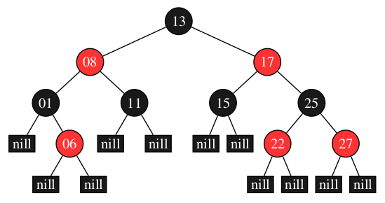

# Comparação das Estruturas em Árvore

<h2>Problema</h2>

Até o momento trabalhamos com três modelos de árvore, binária, avl e redblack. Chegou o momento de compararmos tais estruturas, observando seu comportamento sob diferentes volumes de dados. Para tanto, elabore arquivos que contenham 500 , 5000 , 50.000 , 500.000 entradas numéricas do tipo ponto flutuante. Para tanto, tente evitar repetições de valores em grande escala para que possamos ter uma estrutura profunda. Considere produzir os menores a partir dos maiores volumes de forma randômica. Feito a isso, vamos testar os seguintes processos:

1) Qual o tempo gasto com pesquisa para um arquivo de entrada com 10.000 consultas. Considere como consulta a busca de um determinado número na estrutura escolhida. Para cada pesquisa, é preciso remover o elemento da árvore, retornando esse número para o usuário. Então, considere o processo de remoção como parte final do processo. 

2) Qual o tempo necessário para montar a estrutura em memória. 

3) Qual o ganho dessas estruturas ao compará-las a vetores ordenados e aplicados à pesquisa binária. Qual o tempo gasto com a ordenação do vetor? Foi possível produzi-lo em memória? 

4) Adotando como estrutura o map e unorder_map do C++, há ganhos maiores nesse processo de pesquisa?

Elabore um relatório detalhando a implementação dessas estruturas, funcionamento da aplicação, exemplo de resultado, modo de compilação e conclusões. Considere essa última seção como uma discussão de quando adotar cada estrutura acima citada e o por quê de tal escolha. Para toda essa discussão, apresentar gráficos que demonstrem os resultados obtidos durante o processo de análise.

  

<h2>Estruturas Utilizadas</h2>

* <h3>Árvore Binária</h3>

	Em uma árvore binária, cada elemento é denominado nó da árvore e sua posição na estrutura pode levar a uma de três nomenclaturas. Se o nó é o primeiro inserido, denominamos tal elemento como <b>raiz</b> da árvore. Partindo da <b>raiz</b>, temos por designação dois filhos, <b>filho esquerdo</b> e <b>filho direto</b>. Um filho é posicionado a esquerda, se somente se, seu valor de teste é menor que o valor do nó onde este será conectado. Este nó de conexão é conhecido como <b>nó pai</b>. Por conseguinte, os filhos tidos como direitos seguem a mesma regra, contudo, para valores maiores.

 

Para mais informações acesse:  <a href="https://github.com/mpiress/basic_tree">Árvore Binária</a>
    
* <h3>Árvore AVL</h3>

	Em uma árvore binária do tipo AVL, os nós se mantêm aprocimadamente balanciados. Isso permite que processos de inserção, remoção e pesquisa sejam realizados sob custo computacional de O(logn).

	Para a realização dos balanceamentos, a AVL modifica o método de inserção da árvore binária, introduzindo nela um procedimento de avaliação de peso e quatro modelos de rotação.

	O fator de peso é utilizado para identificar quando a árvore se apresenta desbalanceada, para com isso identificar que tipo de rotação é preciso empregar na estrutura para que essa volta e se manter aproximadamente balanceada. A abordagem do fator de peso pode ser observada através da Fig 1. 

 

 Fig 1. Exemplo de árvore AVL. 

Para mais informações acesse:  <a href="https://github.com/mpiress/avl_tree">Árvore AVL</a>

* <h3>Árvore Rubro-Negra</h3>

	Em uma árvore binária do tipo Red Black (RB), os nós se mantêm aprocimadamente balanciados por meio de uma estratégia de cores. Diferente da AVL, em uma RB os nós são avaliados considerando um processo de parentesco, em que vizinhos são considerados e esses devem obedecer certos critérios de cor para indicar que a estrutura se encontra balanceada. Isso permite que processos de inserção, remoção e pesquisa sejam realizados sob custo computacional de O(logn). Um exemplo da estrutura de uma RB pode ser observada na Fig 1.

   
  <caption>Fig 1. Exemplo de estrutura de uma árvore binária do tipo Red Black.</caption>

Para mais informações acesse:  <a href="https://github.com/mpiress/RedBlack">Árvore Rubro-Negra</a>

* <h3>Vector</h3>

* <h3>Map</h3>

* <h3>Unordered Map</h3>

<h2>Resolução</h2>

<h2>Exemplo de Execução</h2>

<h2>Resultados Obtidos</h2>

<h2>Referências</h2>

https://github.com/mpiress/basic_tree

https://github.com/mpiress/avl_tree

https://github.com/mpiress/RedBlack

|                    | Inserção | Busca | Remoção |
|--------------------|----------|-------|---------|
| Árvore Binária     |          |       |         |
| Árvore Avl         |          |       |         |
| Árvore Rubro-Negra |          |       |         |
| Vector             |          |       |         |
| Map                |          |       |         |
| Unordered Map      |          |       |         |
    

<h2>Compilação e Execução</h2>

O progama disponibilizado possui um arquivo Makefile que realiza todo o procedimento de compilação e execução. Para tanto, temos as seguintes diretrizes de execução:

| Comando                |  Função                                                                                           |                     
| -----------------------| ------------------------------------------------------------------------------------------------- |
|  `make clean`          | Apaga a última compilação realizada contida na pasta build                                        |
|  `make`                | Executa a compilação do programa utilizando o gcc, e o resultado vai para a pasta build           |
|  `make run`            | Executa o programa da pasta build após a realização da compilação                                 |
